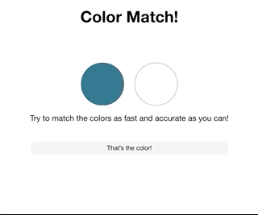

This project was bootstrapped with [Create React App](https://github.com/facebook/create-react-app).

# Not 4 Colorblinds 👀

This is a simple game for you to test your skills on how accurate you are judging colors!

## Quick start

Download dependencies

`$ yarn`

Run the project

`$ yarn start`

## Score

The score is calculated based on the distance between the color you choose and the color presented randomly.

## Future developments

Add a counter and influence score with the time you took to submit the color. Of course the proximity will have more weight than the time, but you can always try to improve.
